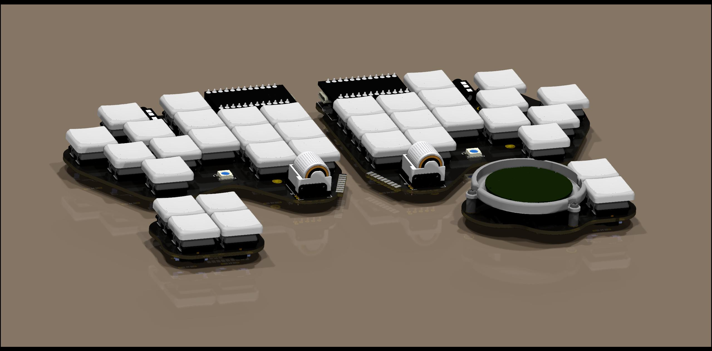
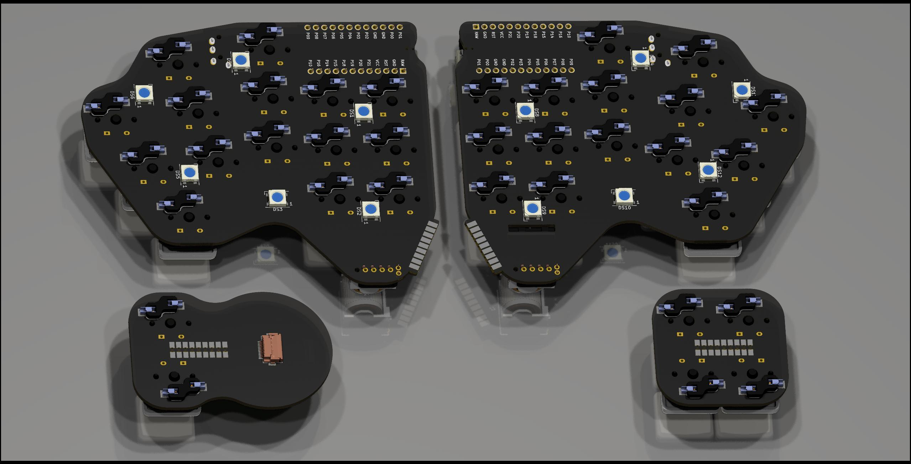
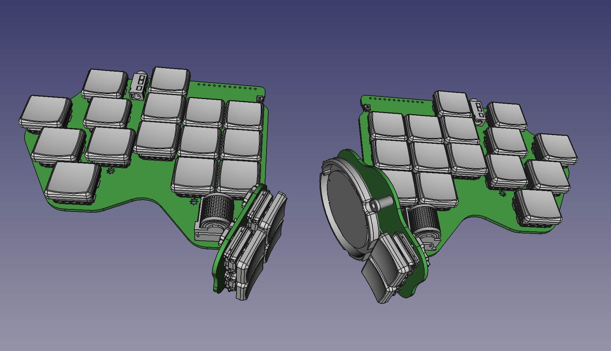
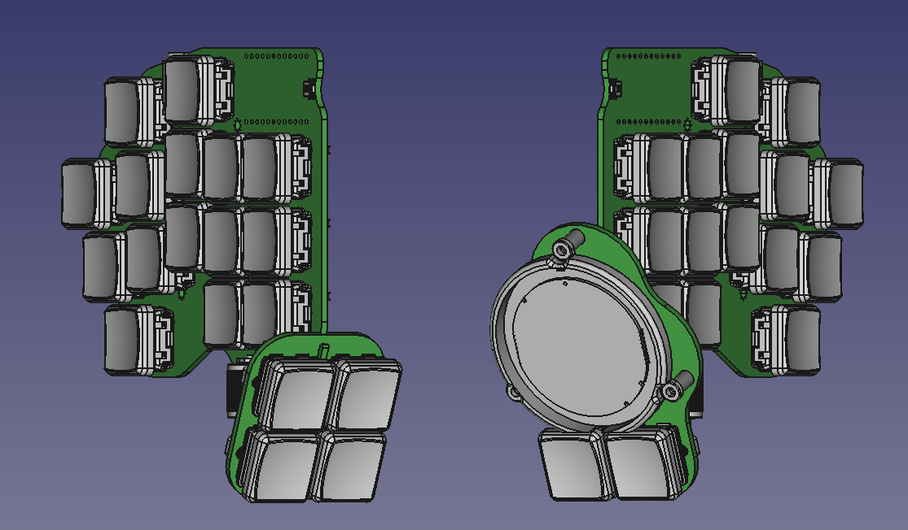
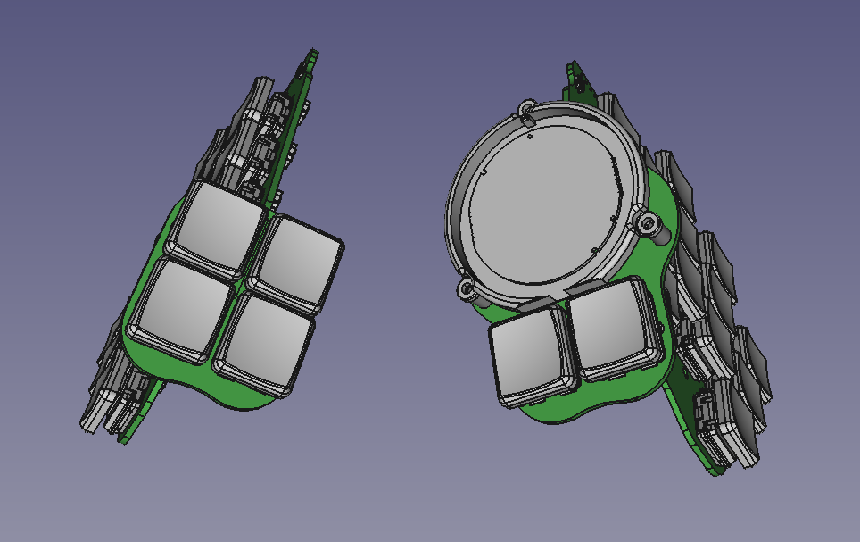

# Dovetail Keyboard

Uses a modified version of ergogen that supports placing arbitrary library parts.

### FreeCAD Pics (some parts didn't survive the conversion process)

## Features

-   underglow
-   trackpad (tm035035-2024-003)
-   solder-on 90-degree thumb clusters
-   choc spacing
-   36 keys

To update using ergogen:

-   `node ergogen/src/cli.js ergogen.yaml -o .`
-   Open pcb in pcbnew
-   Tools -> Update Footprints from Library
-   Check all "Update Options"
-   Update

## Parts list

| Qty | Part                       | Info                                                                                          | Link(s)                                                   |     |
| --- | -------------------------- | --------------------------------------------------------------------------------------------- | --------------------------------------------------------- | --- |
| 2   | KB2040                     | QMK compatible pro-micro footprint. Currently must have QMK for trackpad, recommmended RP2040 | https://www.adafruit.com/product/5302                     |     |
| 2   | PJ-320A Jack               |                                                                                               | https://www.aliexpress.com/item/2251832181971069.html     |     |
| 36  | Kailh Choc Hotswap Sockets |                                                                                               | https://www.aliexpress.com/item/3256803389452947.html     |     |
| 3   | M2 Standoffs               | Trying M2x7                                                                                   | https://www.aliexpress.com/item/2251832782516182.html     |     |
| 3   | M2 Screws                  |                                                                                               |                                                           |     |
| 1   | FPC Cable                  | 0.5mm pitch, 12pin, same side (but probably should cut and strip yourself anyways)            | https://www.aliexpress.com/item/3256801417741263.html     |     |
| 1   | FPC Connector              | 12P, 0.5mm pitch                                                                              | https://www.aliexpress.com/item/2261800162045502.html     |     |
| 4   | MCU Sockets (optional)     | I like these ones - PH3.5, use them with regular headers                                      | https://www.aliexpress.com/item/2251832713321083.html     |     |
| 2   | Scroll Wheel               |                                                                                               | https://www.aliexpress.com/item/2251832804635444.html     |     |
| 14  | WS2812b 5050               |                                                                                               | https://www.aliexpress.com/item/3256802466699315.html     |     |
| 1   | TM035035-2024-003 Trackpad | Cirque Glide Trackpad with overlay                                                            | https://www.mouser.com/ProductDetail/355-TM0350352024-003 |     |
| 2   | EVQ-P7C01P Reset Switch    | I wanted to be fancy lol                                                                      | https://www.mouser.com/ProductDetail/667-EVQP7C01P        |     |
| 1   | Trackpad holder part       | Probably want 2 just in case                                                                  | [In repo](Models/trackpad-holder-Fusion.stl)              |     |
| 1   | 1 of each PCB minimum      | left-main, right-main, left-thumb, right-thumb (you could actually interchange the thumbs)    | [In repo](gerbers)                                        |     |
| 2   | Plates        | Untested                                                                                           | [In repo](outlines/cutout_with_holes.dxf)                                                          |     |
| 12   | M2 standoffs (5mm)         | Untested                                                                                           | https://www.aliexpress.com/item/2251832782591461.html                                                          |     |
| 2  | 1/4in lock nut         | Untested                                                                                           | https://www.aliexpress.com/item/3256802483856268.html                                                          |     |
| 2  | Camera swivel thingy        | Untested                                                                                           | https://www.aliexpress.com/item/3256803400603212.html                                                          |     |
| 2  | Magnetic Base        | Untested                                                                                           | https://www.aliexpress.com/item/3256803496352836.html                                                          |     |
| 36  | Diodes           |                                                                                               |      |     |
| 1   | Case (optional)            |                                                                                               | https://www.aliexpress.com/item/3256803532895347.html     |     |

## Notes

-   Designed for 3.3v power/logic (kb2040)
    -   if you want to use 5v then you have to desolder more on the trackpad pcb
-   Rectangular size (at most): ~ 14cmx11cmx5.5cm

## Inspo/Useful Links
- https://www.reddit.com/r/ErgoMechKeyboards/comments/uq2yyq/kyria_with_cirque_circle_trackpad/
- https://github.com/macroxue/keyboard-tenting
- https://www.reddit.com/r/PeripheralDesign/comments/uk9l94/trackball_emulation_on_cirque_glidepoint_circle/
- https://www.cirque.com/message-board?p=post%2Fusing-the-cirque-tm035035-and-tm040040-circle-trackpads-in-5v-systems-10126328
- https://github.com/dkao/qmk_firmware/commits/cirque_trackpad_features
- https://www.thingiverse.com/thing:5385829/files
- https://github.com/Bastardkb/dilemma
